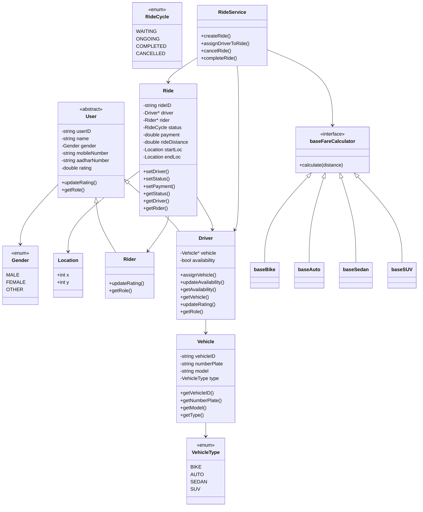

# 🚕 Ride Sharing System – Low Level Design (LLD)

This repository contains a **Low Level Design (LLD)** implementation of a ride-sharing system written in **C++**, focusing on **clean domain modeling**, **separation of concerns**, and **extensible business logic**.

The goal of this project is **not** to build a production-ready system, but to demonstrate **how a real backend system is structured at the LLD level**.

---

## 📌 Key Design Principles

* **Clear domain entities** (User, Driver, Rider, Vehicle, Ride)
* **Service layer for orchestration** (`RideService`)
* **Strategy pattern for pricing** (vehicle-based fare calculation)
* **Explicit ride lifecycle states**
* **Role-based Rating System**
* **Enum classes for stratergic defined values - Gender, VehicleType, and RideCycle**

---
## 📊 Flowchart – Ride Execution



---

## 🧱 Core Components

### 1️⃣ Domain Entities

| Entity    | Responsibility                                |
| --------- | --------------------------------------------- |
| `User`    | Abstract base for system users                |
| `Rider`   | Represents customer requesting a ride         |
| `Driver`  | Represents driver with vehicle & availability |
| `Vehicle` | Vehicle metadata & type                       |
| `Ride`    | Holds ride state and associations             |

Entities are kept **lightweight** and only store **state + data**.

---

### 2️⃣ Service Layer – `RideService`

All **business workflows** and **state transitions** are handled here:

* Creating rides
* Cancelling rides
* Assigning drivers
* Starting rides
* Completing rides
* Calculating fares

This keeps entities clean and reusable.

---

### 3️⃣ Pricing Strategy

Fare calculation is implemented using a **strategy-like design**:

* `baseFareCalculator` (interface)
* `baseBike`, `baseAuto`, `baseSedan`, `baseSUV`

Fare is selected dynamically based on `VehicleType`.

---

## 🔄 Ride Lifecycle

A ride moves through the following states:

```
WAITING → ONGOING → COMPLETED
        ↘
         CANCELLED
```

State transitions are **strictly validated** in the service layer.

---

## 🧭 High-Level Flow (Execution)

### Step-by-step flow:

1. Rider requests a ride
2. `RideService` creates a `Ride`
3. Driver is assigned (if available)
4. Ride starts / Ride is cancelled in which case the RideCycle becomes terminated
5. Ride completes
6. Fare is calculated based on vehicle type & distance

---

## 🧪 Example Usage (Conceptual)

```cpp
RideService service;

Ride* ride = service.createRide("R1", rider, startLoc, endLoc);
service.assignDriverToRide(ride, driver);
service.startRide(ride);
service.completeRide(ride);
```

---

## 🚫 What This Design Intentionally Avoids

* Database / persistence layer
* Driver matching algorithms
* Payment gateway integration
* Distributed system concerns

These are **out of scope** for LLD and can be layered later.

---

## 🎯 Why This Design Works Well 

* Executed **clean OOP principles of Abstraction,Inheritance, Encapsulation and Polymorphism**
* Demonstrates **service-oriented thinking**
* Uses **real design patterns naturally**
* Avoids over-engineering

This is the level of depth **of a carefully though-out low level design**.

---

## 🏁 Summary

This project demonstrates how to:

* Model a real-world system using OOP
* Separate domain logic from workflows
* Design extensible and readable LLD code

---

**Author:** Shreedhar Goyal
